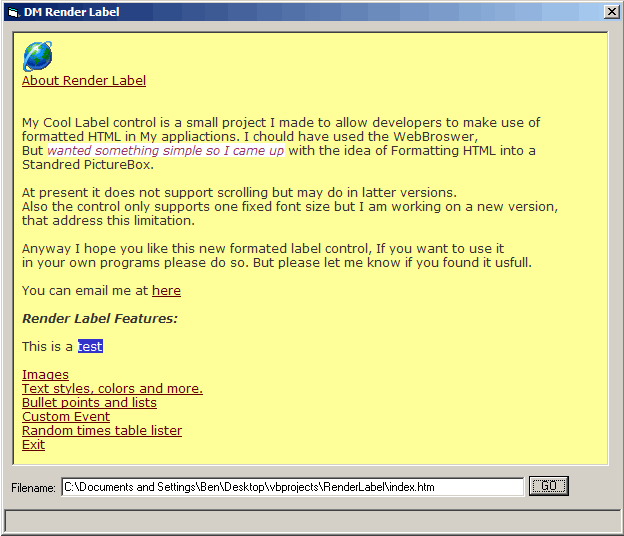



## DM Render Label

### Description

hi all this is a small user control I made to allow you to render basic HTML, at the moment it supports, Text Colors, Text styles, bold, italic, underline etc, Images, Page background images and colors, Bullet points and Lists, Hyperlinks, Page Redirect,Horizontal Lines,Text Alignment. and more. if you like this Next time I may add scrollbars hope you like it please vote.
 
### More Info
 

             |
---                |---
**Submitted On**   |2006-06-02 06:02:38
**By**             |[dreamvb](https://github.com/Planet-Source-Code/PSCIndex/blob/master/ByAuthor/dreamvb.md)
**Level**          |Beginner
**User Rating**    |5.0 (139 globes from 28 users)
**Compatibility**  |VB 6\.0
**Category**       |[Internet/ HTML](https://github.com/Planet-Source-Code/PSCIndex/blob/master/ByCategory/internet-html__1-34.md)
**World**          |[Visual Basic](https://github.com/Planet-Source-Code/PSCIndex/blob/master/ByWorld/visual-basic.md)
**Archive File**   |[DM\_Render\_199827622006\.zip](https://github.com/Planet-Source-Code/dreamvb-dm-render-label__1-65549/archive/master.zip)

